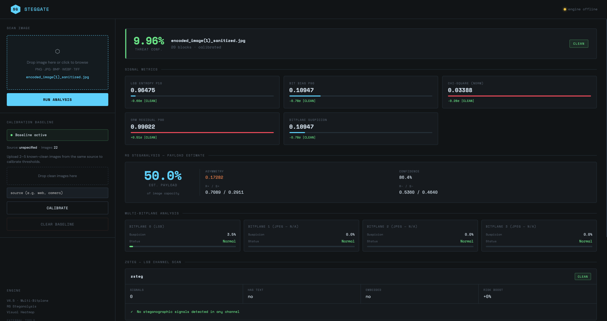
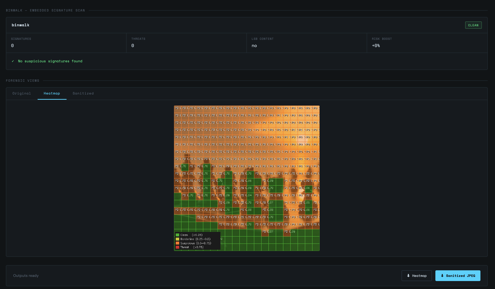
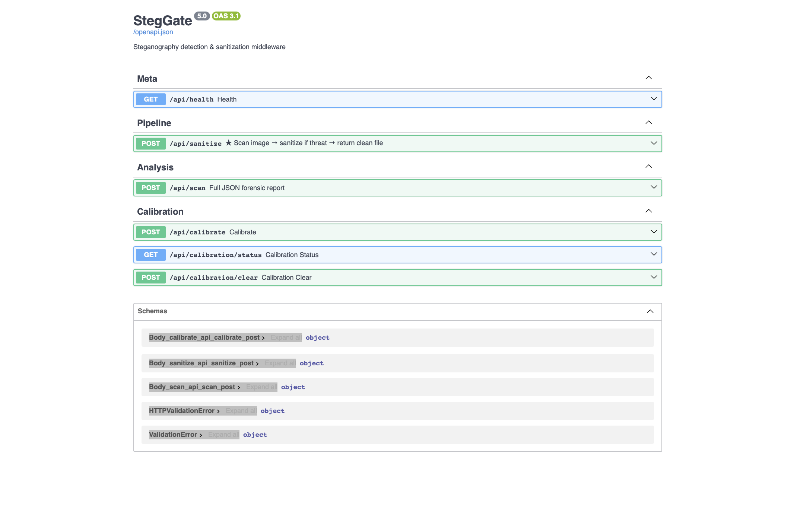
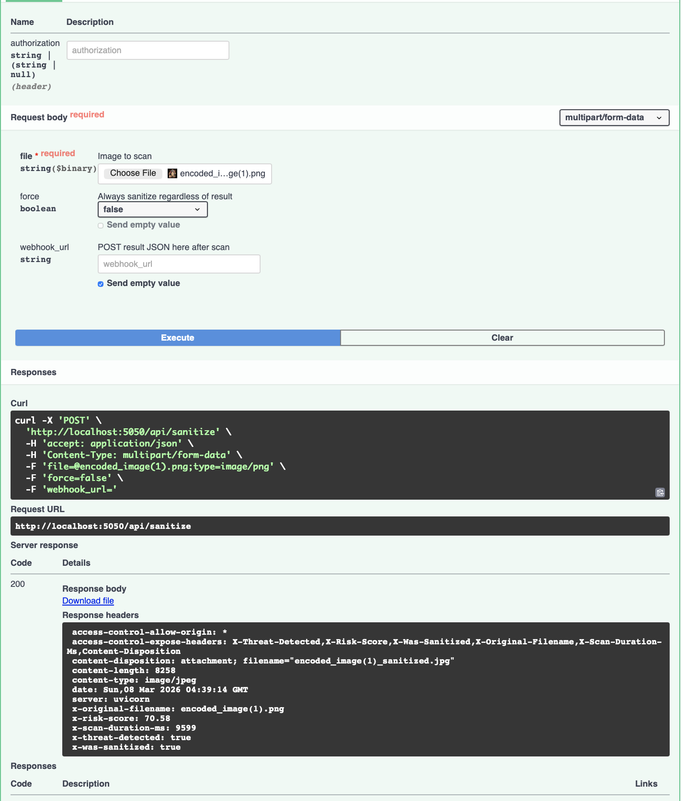

# 🛡️ StegGate – Secure Image Upload with Steganography Detection

**StegGate** is a security-focused web application that detects and sanitizes hidden malicious data embedded inside images using steganography detection techniques.

Attackers can hide malware, scripts, or sensitive data inside normal-looking images. StegGate acts as a **security layer for image uploads**, scanning images and returning a **sanitized safe version** before they are stored or used.

---

# 🚨 Problem

Many platforms allow users to upload images such as:

* profile pictures
* attachments
* social media content
* documents

Attackers can hide malicious data inside these images using **steganography**, which may lead to:

* hidden malware payloads
* data exfiltration
* command-and-control communication
* embedded executable files

Traditional file validation often fails to detect these hidden threats.

---

# 💡 Solution

StegGate introduces a **secure image upload workflow** that scans images before they are stored.

Workflow:

```text
User uploads image
        │
StegGate Web Application
        │
Image scanning engine analyzes file
        │
If hidden data is detected → sanitize image
        │
Return clean image + security result
```

This ensures that **only safe images are used by the application**.

---

# 🏗 System Architecture

```
User Upload
     │
Web Interface
     │
Image Processing Module
 ├ Steganography Detection
 ├ Embedded Payload Detection
 └ Statistical Image Analysis
     │
Risk Evaluation
     │
Sanitization Module
     │
Return Clean Image
```

---

# ⚙️ Key Features

### 🔍 Steganography Detection

Detects hidden data embedded inside image pixels.

* LSB hidden message detection
* zsteg analysis

---

### 📦 Embedded Payload Detection

Detects files hidden inside images.

* binwalk scanning
* ZIP / executable signature detection

---

### 📊 Image Statistical Analysis

Identifies abnormal image characteristics using:

* entropy analysis
* pixel noise analysis
* anomaly detection

---

### 🧹 Image Sanitization

If suspicious content is detected:

* metadata is removed
* hidden payload is removed
* image is re-encoded safely

The system returns a **sanitized safe image**.

---

# 🖥 Tech Stack

Backend

* Python
* FastAPI

Image Processing

* OpenCV
* NumPy
* Pillow
* scikit-image

Security Tools

* Stegano
* zsteg
* binwalk

Frontend

* HTML
* CSS
* JavaScript

---

# 📁 Project Structure

```
steggate/
│
├ backend/
│  ├ main.py
│  ├ utils.py
│  ├ routes/
│  │   └ scan_route.py
│  ├ uploads/
│  └ sanitized/
│
├ frontend/
│  ├ index.html
│  ├ script.js
│  └ style.css
│
└ requirements.txt
```

---

# 🚀 Running the Project Locally

### 1️⃣ Clone repository

```
git clone https://github.com/yourusername/steggate.git
cd steggate
```

### 2️⃣ Create virtual environment

```
python -m venv venv
```

Activate environment:

Windows

```
venv\Scripts\activate
```

Mac/Linux

```
source venv/bin/activate
```

### 3️⃣ Install dependencies

```
pip install -r requirements.txt
```

### 4️⃣ Start the server

```
python -m uvicorn backend.main:app --reload
```

Open in browser:

```
http://127.0.0.1:8000
```

---

# 🔮 Future Scope

This project currently runs as a **local prototype web application**.

Future improvements include:

* deploying StegGate as a **public security API**
* API key authentication
* scalable cloud deployment
* support for additional file types

---

# 🎯 Use Cases

* social media platforms
* messaging applications
* cloud storage services
* enterprise file upload systems

---

# 👨‍💻 Authors

StegGate Security Prototype
Built as a secure image upload system.






